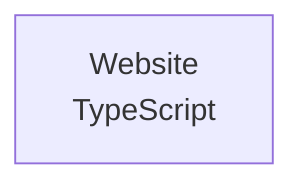

# EGR Computer Science Club Website

This is the website for the computer science club at East Grand Rapids High School, with a landing page, an about section, and links to the club's Instagram and Discord. It is a static single page built with TypeScript and Webpack that uses GSAP and Barba.js for page transitions and a falling snow animation.

